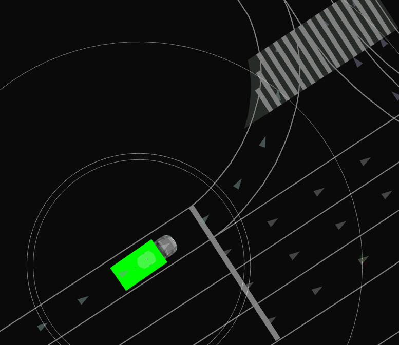
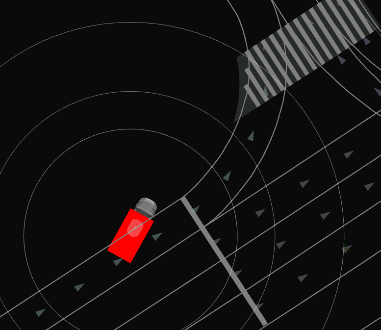

# lane width calculator


This packages try to visualize the geometrical relationships between vehicle and lanelet.


## Usage 

This packages provide a markerarray topic which contains whether the input pose vehicle is inside the current lanelent.


### installation 

Just clone this package and build it with colcon.

```bash
# cd ~/autoware/src
# git clone
# cd src folder
colcon build --symlink-install --cmake-args -DCMAKE_BUILD_TYPE=Release --packages-select lane_width_calculator
```

### default launcher

Run following launch file to start the node.

```bash
ros2 launch lane_width_calculator lane_width_calculator.launch.xml
```

### Visualize settings

The default output is `/debug/vehicle_lane_marker` topic.


| visualization color | description | sample figure |
|---------------|-------------|--------------|
| green       | when the whole bbox of the vehicle is inside the current lanelet. | |
| red         | when any part of the vehicle is outside the current lanelet. | |


## Parameter Settings

#### Input

| Name                 | Type               | Description                      |
| -------------------- | ------------------ | -------------------------------- |
| `input/PoseStamped`  | `PoseStamped`      | Vehicle's current pose           |
| `input/HADMapBin`    | `HADMapBin`        | High-definition map data         |
| `input/Odometry`     | `Odometry`         | Vehicle's odometry information   |

#### Output

| Name                           | Type                                   | Description                             |
| ------------------------------ | -------------------------------------- | --------------------------------------- |
| `output/MarkerArray`           | `visualization_msgs::msg::MarkerArray` | Marker array for visualizing lane width |

### Parameters

| Name               | Type   | Default Value | Description                   |
| ------------------ | ------ | --------------| ----------------------------- |
| `vehicle_width`    | double | 2.5           | Width of the vehicle (meters) |
| `vehicle_length`   | double | 5.0           | Length of the vehicle (meters)|
| `vehicle_height`   | double | 3.0           | Height of the vehicle (meters)|
| `use_odom`         | bool   | true          | Flag to use odometry data     |


